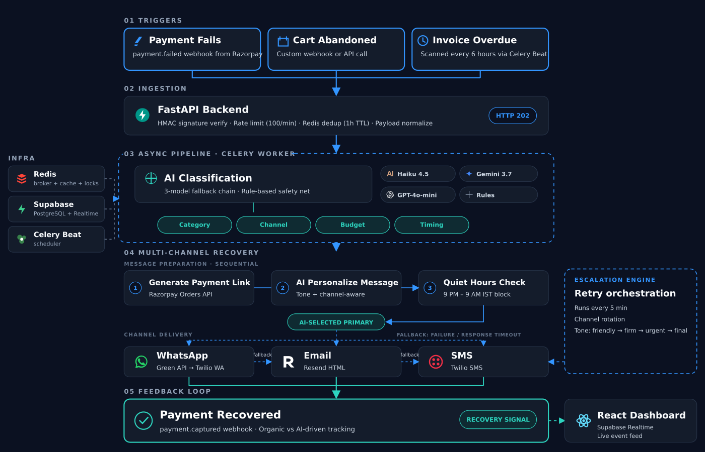
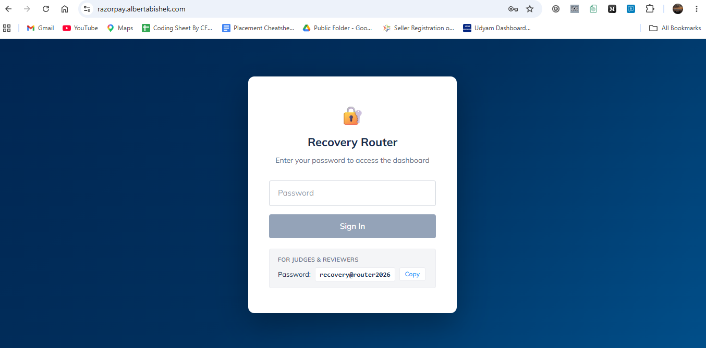
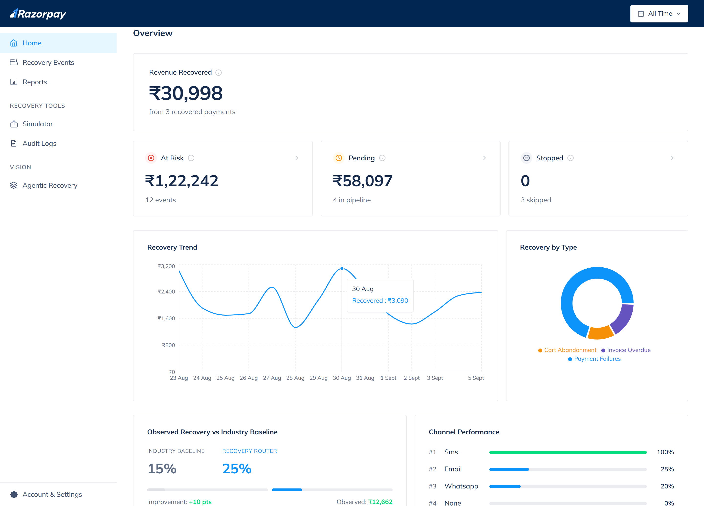
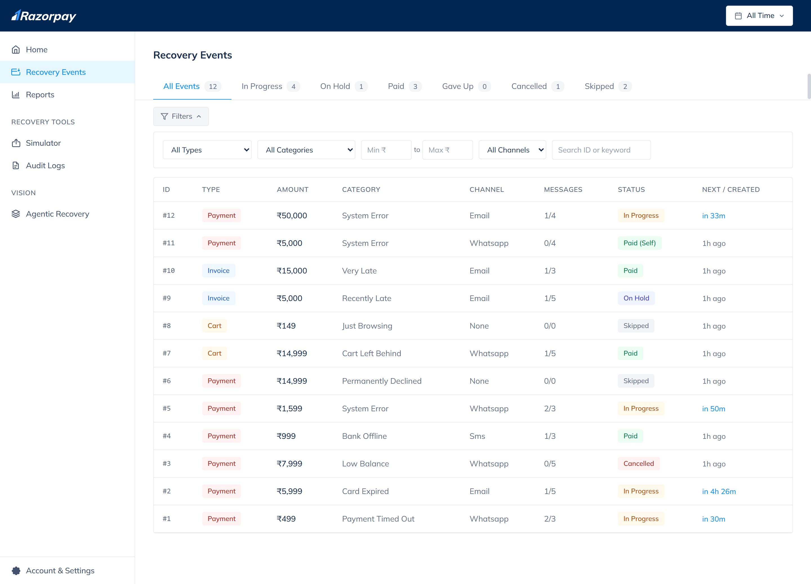
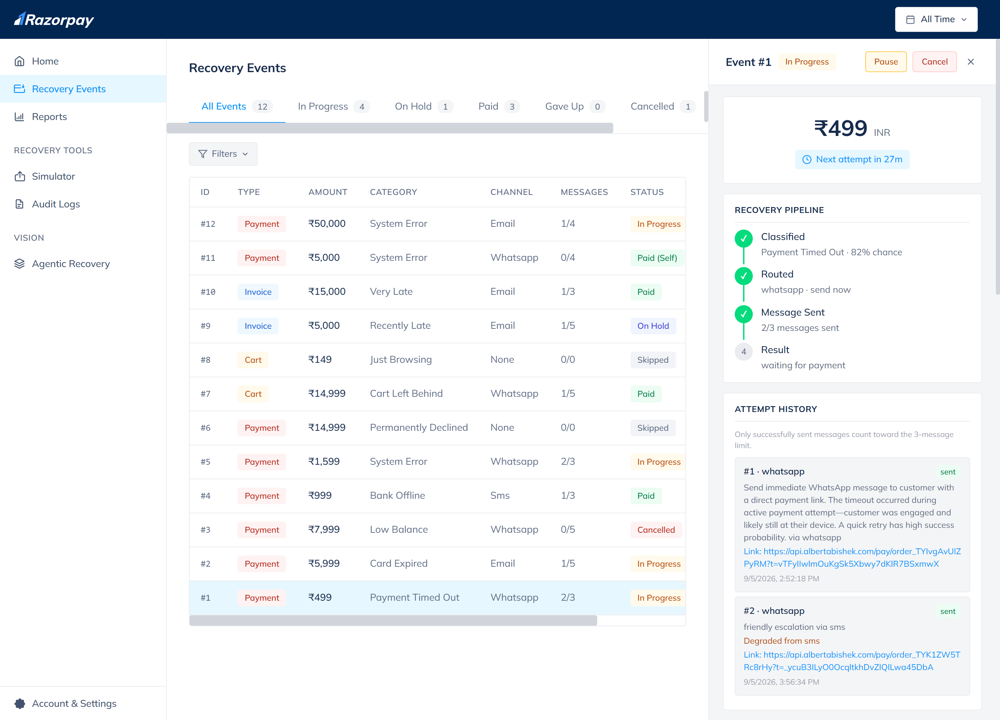
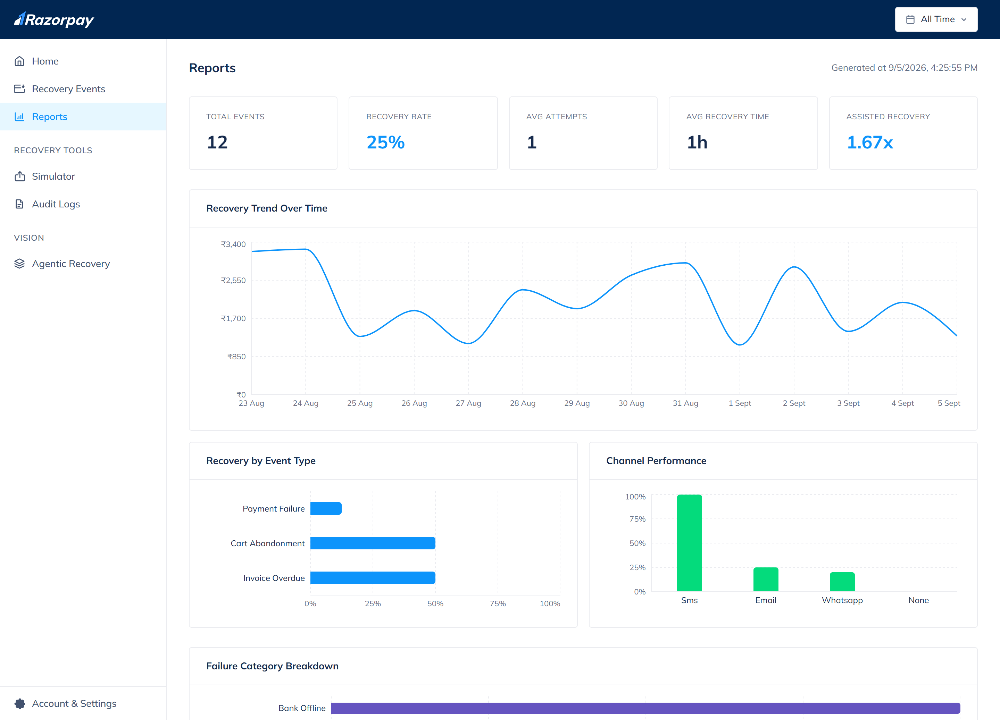
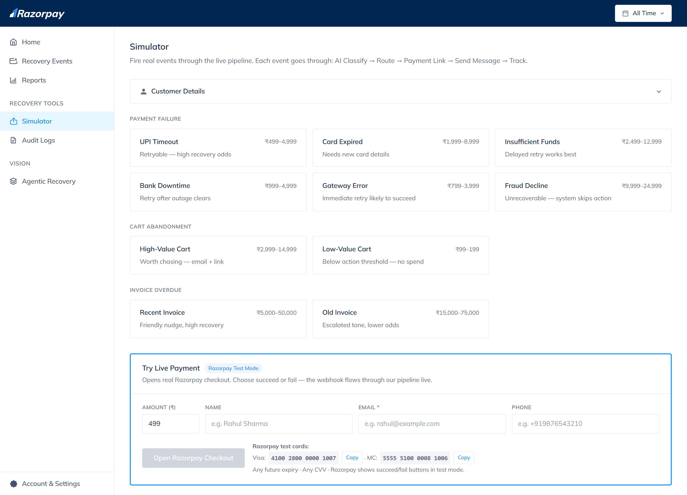
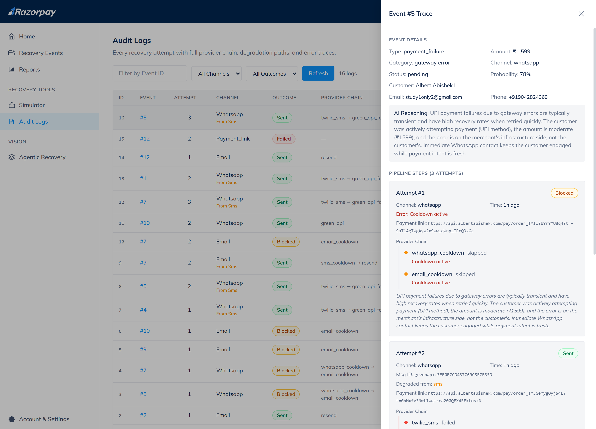
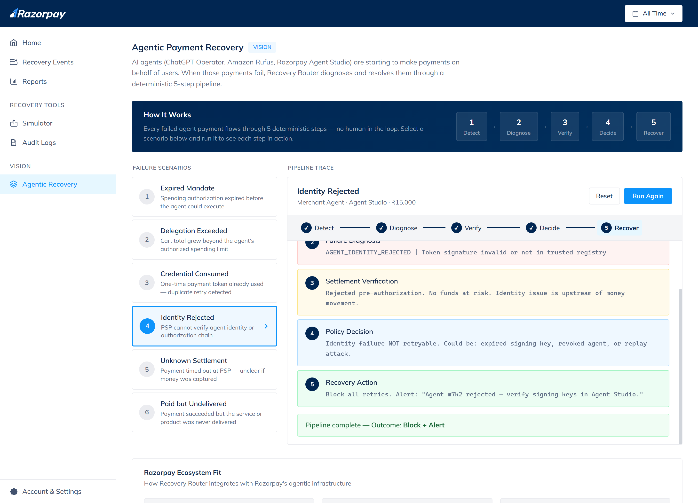

# Recovery Router

**An autonomous, AI-native recovery engine for Razorpay merchants.**

I built a system that takes failed payments, abandoned carts, and overdue invoices, classifies why they failed using AI, decides the best recovery action, and sends personalized messages through WhatsApp, Email, or SMS. Merchants configure credentials and deploy — the pipeline handles classification, routing, and messaging autonomously from there.

Built for **Razorpay AI Buildathon 2026 - Track 3** (Revenue Recovery).

**[Live Dashboard](https://razorpay.albertabishek.com)** · **[API Docs](https://api.albertabishek.com/docs)** · **[Landing Page](https://albertabishek.com)**

---

## The Problem

Indian D2C merchants on Razorpay see ~68% payment success rates. That's 1 in 3 payments failing. Add abandoned carts and overdue invoices, and merchants are leaking revenue from three separate holes - with no single system that understands *why* each failure happened and routes it to the right recovery action.

Recovery Router is my answer: one pipeline for all three leak types.

---

## System Architecture



### Six Components

| Component | Technology | Role |
|-----------|-----------|------|
| **API Server** | FastAPI + Uvicorn | Webhook ingestion, REST API, hosted checkout |
| **Task Worker** | Celery (prefork pool) | Async pipeline: classify → route → send |
| **Scheduler** | Celery Beat | Escalation every 5 min, invoice scan every 6h |
| **Frontend** | React 19 + Vite 8 + Tailwind 4 | Merchant dashboard with live event feed |
| **Broker/Cache** | Redis | Message broker, dedup, rate limiter, distributed locks, PII store |
| **Database** | Supabase (PostgreSQL) | Persistent storage, REST API |

---

## The Pipeline

Every recovery event - payment failure, cart abandonment, or overdue invoice - goes through the same 6-step pipeline as a single atomic Celery task:

```
Webhook → HMAC verify → Rate limit → Redis dedup → Normalize
    ↓
Celery Worker picks up task
    ↓
1. AI Classification (3-model fallback → rules)
2. Route action (send_now / send_delayed / no_action)
3. Generate Razorpay payment link (Orders API + server-side PII)
4. AI-personalized message generation
5. Send via channel (WhatsApp → SMS → Email fallback chain)
6. Log attempt + schedule next escalation
```

---

## AI Classification System

The classifier is the brain of the pipeline. It receives the full event context and returns a structured decision.

### The Prompt

This is the actual system prompt I use (`backend/app/services/classifier.py`):

```
You are the classification engine for a payment recovery system used by
Indian merchants on Razorpay.

Your job: analyze a failed payment, abandoned cart, or overdue invoice
and determine the best recovery strategy.

How to think about this:

1. READ the error_description carefully - it contains the real reason.
   - "Payment timed out" with method=upi means network congestion,
     NOT user abandonment. High recovery chance.
   - "Card declined" is ambiguous - look at amount and error_code.
   - "Bank server unavailable" is temporary - very high recovery.

2. CONSIDER the amount - it affects urgency and channel choice.
   - High amounts (>₹5000) justify WhatsApp over email.
   - Low amounts (<₹200) on cart abandonment → likely just browsing.
   - Very high amounts (>₹50000) on invoices → professional email.

3. PICK the right channel for the situation:
   - WhatsApp: urgent, time-sensitive, high-recovery scenarios
   - Email: formal, non-urgent, detailed (card updates, invoices)
   - SMS: brief reminder (insufficient funds, secondary nudge)
   - None: fraud, stolen cards, browse-only carts

4. DETECT user-initiated cancellations:
   - If error_description mentions "cancelled", "user aborted" → user_cancelled
   - Don't send immediate retry - wait at least 1 hour

5. SET timing based on what will actually help:
   - immediate: UPI timeouts, gateway errors
   - 30_minutes: bank downtime (wait for bank to recover)
   - 1_hour: cancellations, cart abandonment
   - 4_hours: insufficient funds (give time to transfer money)

6. ESTIMATE recovery_probability honestly based on ALL signals.
   A ₹499 UPI timeout has higher recovery (0.85) than a ₹49,999
   card decline with "suspected fraud" (0.0).
```

### AI Output Schema

```json
{
  "leak_type": "payment_failure",
  "failure_category": "upi_timeout",
  "recovery_probability": 0.82,
  "recommended_channel": "whatsapp",
  "recommended_timing": "immediate",
  "reasoning": "UPI timeout during peak hours - customer was actively trying to pay",
  "alternative_action": "Send email if WhatsApp fails",
  "personalization_hint": "Acknowledge the timeout, offer instant retry link"
}
```

### 12 Classification Categories

| Category | Probability | Channel | Timing | Budget |
|----------|------------|---------|--------|--------|
| `upi_timeout` | 75-85% | WhatsApp | Immediate | 3-5 |
| `bank_downtime` | 70-85% | WhatsApp | 30 min | 3-5 |
| `gateway_error` | 80-90% | WhatsApp | 5 min | 3-5 |
| `card_expired` | 40-60% | Email | Immediate | 3-4 |
| `insufficient_funds` | 30-50% | SMS | 4 hours | 3 |
| `user_cancelled` | 20-40% | WhatsApp | 1 hour | 2 |
| `unrecoverable_decline` | 0% | None | - | 0 |
| `high_intent_abandonment` | 30-50% | WhatsApp | 1 hour | 3 |
| `browse_only_abandonment` | 5-10% | None | - | 0 |
| `recently_overdue` | 60-80% | WhatsApp | Immediate | 3-5 |
| `moderately_overdue` | 30-50% | Email | Immediate | 3-4 |
| `long_overdue` | 10-20% | Email | - | 2 |

### 3-Model Fallback Chain

```python
# backend/app/services/ai_client.py

MODEL_CHAIN = [
    {"id": "anthropic/claude-haiku-4.5",  "timeout": 12, "max_retries": 1},
    {"id": "google/gemini-3.7-flash",     "timeout": 10, "max_retries": 1},
    {"id": "openai/gpt-4o-mini",          "timeout": 12, "max_retries": 1},
]
# If all 3 fail → rule-based classification with 0.7x confidence penalty
```

All three models are called through OpenRouter (single API key, single request format). Each model gets one retry with 0.5s backoff. If all AI is unavailable, `_fallback_classify()` maps error codes to categories using a `FALLBACK_RULES` dictionary.

---

## Dynamic Attempt Budgets

Not every failure deserves the same effort. The system computes `max_attempts` per event:

```python
# backend/app/services/router.py

def compute_max_attempts(amount, recovery_probability, failure_category):
    if failure_category == "unrecoverable_decline":  return 0
    if failure_category == "browse_only_abandonment": return 0
    if failure_category == "user_cancelled":          return 2
    if recovery_probability <= 0.1:                   return 1

    if recovery_probability >= 0.7 and amount >= 5000: return 5
    if recovery_probability >= 0.5 and amount >= 2000: return 4
    if recovery_probability >= 0.3 or amount >= 1000:  return 3
    return 2
```

A ₹30,000 failed payment with 80% recovery probability gets 5 attempts across multiple channels. A browse-only cart worth ₹50 gets zero.

---

## Multi-Channel Recovery

### Provider Fallback Chains

```
WhatsApp: Green API (free-form AI text) → Twilio WA (template) → Email fallback
SMS:      Twilio SMS → Green API WA → Twilio WA → Email fallback
Email:    Resend (AI-personalized HTML with branded template)
```

Every provider attempt is logged in a `degradation_path` array, so the audit trail shows exactly which providers were tried and why each failed.

### AI Message Personalization

Every message is generated by AI based on failure category, amount, customer name, attempt number, and tone escalation:

- **WhatsApp**: max 200 chars, conversational, 1-2 emojis
- **SMS**: max 140 chars, ultra-brief, action-focused
- **Email**: subject + greeting + body + CTA button (branded HTML template)

If AI is unavailable, template fallback messages are used.

### Per-Resource Cooldowns

```python
# 5-minute cooldown per phone number / email address
check_per_resource_cooldown("phone", customer_phone, cooldown_seconds=300)
```

Prevents sending more than one message per customer within 5 minutes, even during concurrent escalation.

<!-- 
### Screenshots


-->

---

## Escalation Engine

The escalation engine runs every 5 minutes via Celery Beat. It picks up pending events whose `next_action_at` has passed and makes an AI-driven decision on what to do next.

### The Escalation Prompt

Actual prompt from `backend/app/services/escalation.py`:

```
You are the escalation decision agent for a payment recovery system.

Decision framework:

1. LOOK at previous attempts AND blocked/failed channels:
   - If WhatsApp was sent but customer didn't act → try email
   - If delivery failed (provider error) → SWITCH channel
   - Check "blocked_channels" - these hit a cooldown. Pick different.

2. ADJUST tone:
   - After 0-1 attempts: friendly, helpful
   - After 2 attempts: direct, acknowledge it's a follow-up
   - After 3+ attempts: honest, final chance

3. WHEN TO GIVE UP:
   - ONLY if attempt_count >= max_attempts
   - OR if ALL previous delivery attempts failed
   - NEVER give up on the first escalation
```

### Safety Override - 3-Layer Give-Up Prevention

The AI might suggest giving up early. Three layers prevent that:

1. **Schema default**: `action` defaults to `"send"`, not `"give_up"` - so partial AI JSON keeps trying
2. **AI override**: checks for untried channels before allowing give-up
3. **Hard guard**: blocks give-up when `attempt_count < max_attempts`, forces channel switch

```python
# If AI says give_up but budget isn't exhausted:
if decision["action"] == "give_up" and attempt_count < max_attempts:
    decision["action"] = "send"  # Force continue
    decision["channel"] = next_available_channel()
```

### Category-Specific Retry Delays

| Category | Delay Between Attempts |
|----------|----------------------|
| UPI timeout, gateway error | 1 hour |
| Bank downtime, high intent cart | 2 hours |
| Card expired | 6 hours |
| Insufficient funds | 8 hours |
| User cancelled | 12 hours |
| Recently overdue invoice | 24 hours |
| Moderately/long overdue | 48 hours |

---

## Concurrency & Safety

### Two-Layer Deduplication

```python
# Layer 1: Redis fast path (1h TTL)
# backend/app/utils/dedup.py
def is_duplicate(event_type, identifier):
    key = f"dedup:{event_type}:{identifier}"
    if r.set(key, "1", nx=True, ex=3600):
        return False  # First time - not a duplicate
    return True       # Already processed

# Layer 2: PostgreSQL unique partial indexes (permanent)
# Catches anything Redis missed (Redis restart, TTL expiry)
CREATE UNIQUE INDEX idx_recovery_events_payment_id_unique
  ON recovery_events (payment_id)
  WHERE payment_id NOT LIKE 'pay_TEST_%';
```

### Distributed Locks

Three lock levels prevent concurrent processing:

| Lock | Key | TTL | Purpose |
|------|-----|-----|---------|
| Global escalation | `lock:escalation` | 240s | One escalation cycle at a time |
| Per-event | `lock:event:{id}` | 300s | No two workers process the same event |
| Delayed send | `lock:event:{id}` | 300s | Delayed task can't race with escalation |

```python
# Atomic lock acquisition with auto-expiry
def _acquire_event_lock(event_id, ttl=300):
    return bool(r.set(f"lock:event:{event_id}", "1", nx=True, ex=ttl))
```

### Action Reservation Pattern

Every message send follows a reserve-before-send pattern to prevent double-sends on worker crashes:

```python
# 1. Reserve the attempt row with an idempotency key BEFORE sending
idem_key = f"{event_id}:initial:1"
sb.table("recovery_attempts").insert({
    "outcome": "reserved",
    "idempotency_key": idem_key,
    ...
}).execute()

# 2. Send the message
result = send_message(channel, customer, message, link)

# 3. Finalize with the real outcome AFTER sending
sb.table("recovery_attempts").update({
    "outcome": "sent" if result["success"] else "failed",
    "message_id": result.get("message_id"),
}).eq("idempotency_key", idem_key).execute()
```

If a worker crashes between reserve and send, the retry hits the unique constraint on `idempotency_key` and skips instead of double-sending. All three send paths (initial, delayed, escalation) use this pattern with structured keys: `{event_id}:{type}:{attempt_number}`.

### Race-Safe State Updates

Every database update on `recovery_events` includes a conditional status filter:

```python
# Only update if status is still "pending" - prevents interleaved writes
sb.table("recovery_events").update(data).eq("id", event_id).eq("status", "pending").execute()
```

If a concurrent process already changed the status, the update affects zero rows and the task exits cleanly.

### Database-Level Safety Trigger

After the [Ghost Writer bug](#ghost-writer-bug), I added a PostgreSQL trigger as the last line of defense:

```sql
-- backend/migrations/004_prevent_premature_exhaustion.sql

CREATE OR REPLACE FUNCTION prevent_premature_exhaustion()
RETURNS TRIGGER LANGUAGE plpgsql AS $$
BEGIN
  IF NEW.status = 'exhausted'
     AND (OLD.status IS NULL OR OLD.status != 'exhausted') THEN
    IF (COALESCE(NEW.attempt_count, 0) < COALESCE(NEW.max_attempts, 5))
       AND COALESCE(NEW.max_attempts, 5) > 0
       AND NEW.skip_reason IS NULL THEN
      RAISE WARNING 'Blocked premature exhaustion of event %', NEW.id;
      NEW.status := OLD.status;
      NEW.current_strategy := OLD.current_strategy;
    END IF;
  END IF;
  RETURN NEW;
END; $$;
```

This blocks ANY writer - application code, manual queries, rogue workflows - from marking an event exhausted when attempts are still remaining.

### Rate Limiting

Sliding window per-endpoint using Redis sorted sets:

| Endpoint | Limit |
|----------|-------|
| Webhooks | 100/min |
| Events API | 60/min |
| Analytics | 30/min |
| Simulator | 10/min |
| Live checkout | 5/min |

### Quiet Hours

No messages between 9 PM and 9 AM IST. Events hitting quiet hours are rescheduled to 9 AM the next day.

---

## Recovery Tracking & Honest Metrics

### Payment Reconciliation

When `payment.captured` or `payment_link.paid` arrives:

1. **Multi-strategy matching**: `notes.recovery_event_id` → `reference_id` → `order_id` → `payment_id`
2. **Validation**: status must be `"captured"`, currency must match, amount within 1% tolerance
3. **Double-attribution prevention**: unique index on `recovered_payment_id` - one payment can't credit two events

### Organic vs AI-Driven Recovery

```python
# backend/app/services/recovery_tracker.py

is_organic = actual_attempt_count == 0 and not has_successful_outreach

if is_organic:
    update_data = {"status": "organic_recovery", ...}
    # Customer paid on their own - don't inflate AI metrics
else:
    update_data = {"status": "recovered", ...}
    # Outreach was sent, customer paid through our link
```

If Recovery Router sent no outreach but the customer paid anyway, it's logged as `organic_recovery`, not `recovered`. I don't want to take credit for something the AI didn't cause.

---

## Payment Link Generation

Uses **Razorpay Orders API** (not Payment Links API) - the Payment Links API has a 30-link limit in test mode.

- Creates a Razorpay order with `recovery_event_id` in notes
- Stores customer PII (name, email, phone) in Redis with a random 24-byte token (24h TTL)
- Checkout URL: `/pay/{order_id}?t={token}` - PII never appears in the URL
- Order ID validated against `^order_[A-Za-z0-9]{8,30}$` regex (XSS prevention)
- All user-supplied strings escaped for both HTML and JavaScript contexts

---

## Security

- **HMAC-SHA256 webhook verification** - timing-safe `hmac.compare_digest` on every webhook
- **XSS prevention** - regex validation on order IDs, HTML escaping on all user inputs in checkout page
- **AI input sanitization** - fields truncated to 200 chars, control characters stripped before AI calls
- **SQL injection protection** - parameterized Supabase queries, no raw SQL in application code
- **Path traversal blocked** - order ID regex prevents `../` in checkout URLs
- **CORS lockdown** - restricted to specific origins (Vercel frontend, localhost dev)
- **SSL enforced** - `CERT_REQUIRED` on all Redis connections
- **Server-side PII** - customer details in Redis with TTL tokens, never in URLs
- **No hardcoded credentials** - all secrets via `.env`, `.gitignore` excludes `.env*`, `*.pem`, `*.key`
- **RLS enabled** - only `service_role` can read/write, frontend talks through the FastAPI backend

---

## Testing

**397 tests across four tiers.**

Tests are split into **unit** (247 offline, no credentials), **live** (92 integration, real services), **e2e** (31 standalone flows), and **frontend** (27 component tests). CI runs 274 tests (unit + frontend) on every push.

```bash
cd backend

# Unit tests — run anywhere, no services needed
pytest tests/unit -v -m unit     # 247 offline logic tests

# Live integration tests — requires server + Redis + Celery
pytest tests/ -v -m live         # 92 integration tests

# Full E2E suite (31 tests, standalone runner)
python tests/e2e_test.py

# Frontend component tests
cd ../frontend && npx vitest run  # 27 component tests
```

### Unit Tests (Offline)

Test pure business logic without any external services:

- **Classifier logic** (13 tests): `_fallback_classify()` across all event types and fallback rules
- **Router logic** (15 tests): `compute_max_attempts()` tiers and `route_action()` channel/timing
- **Quiet hours** (10 tests): `_is_quiet_hours()` boundary conditions across IST timezones
- **Escalation logic** (8 tests): `_pick_next_channel()` rotation, avoid sets, phone/email-only
- **Idempotency keys** (9 tests): Key format conventions and cross-tag uniqueness

### Live Integration Tests

Every test hits the live server - real Redis, real Supabase, real AI classification:

- **API**: 38 endpoint tests across all routes
- **Security**: SQL injection (3 vectors), XSS (3 vectors), CORS (3 origins), webhook signatures, input validation (5 edge cases), path traversal (2 vectors)
- **Pipeline**: All 10 failure scenarios classified correctly, AI fallback chain, dynamic budgets, ghost recovery prevention, race condition guards
- **Edge cases**: 13 error handling tests (duplicate webhooks, invalid transitions, boundary values)
- **Load**: 6 concurrent scenario tests (parallel simulations, race conditions, response times)

---

## Demo

<!-- Replace with actual video link when ready -->
**[Watch the full demo →](#)**

| Section | What's Shown |
|---------|-------------|
| Opening | Personal intro — why Track 3, the insight behind Recovery Router |
| Architecture | Six-component architecture with decision reasons for each choice |
| Live Demo | Simulator scenarios with dynamic budgets, then real Razorpay test-mode checkout |
| Dashboard | Events page walkthrough — classifications, budgets, AI reasoning |
| Safety | 18 defense layers, 3-layer give-up prevention, the Ghost Writer bug story |
| Analytics | Honest metrics — organic vs recovered, ghost recovery prevention |
| Testing | 397-test suite run + CI pipeline + bug war stories |
| Ecosystem | Where Recovery Router fits in Razorpay's product suite |
| Future | Agent-to-agent recovery — when the payer is an AI agent |

---

## Dashboard Screenshots

<table>
  <tr>
    <td align="center" width="50%">
      
      <br/><b>Login</b><br/>
      <sub>Razorpay-themed authentication with Prussian Blue gradient</sub>
    </td>
    <td align="center" width="50%">
      
      <br/><b>Overview Dashboard</b><br/>
      <sub>Revenue recovered, at-risk amount, recovery trend chart, and donut breakdown by event type</sub>
    </td>
  </tr>
  <tr>
    <td align="center" width="50%">
      
      <br/><b>Recovery Events</b><br/>
      <sub>Filterable event list with status tabs, category/channel/amount filters, and search</sub>
    </td>
    <td align="center" width="50%">
      
      <br/><b>Event Detail Panel</b><br/>
      <sub>Full event trace — AI classification, recovery pipeline, attempt history, and timeline</sub>
    </td>
  </tr>
  <tr>
    <td align="center" width="50%">
      
      <br/><b>Reports & Analytics</b><br/>
      <sub>Recovery by event type, channel performance, trend line, and failure category breakdown</sub>
    </td>
    <td align="center" width="50%">
      
      <br/><b>Simulator</b><br/>
      <sub>10 built-in test scenarios with live Razorpay checkout integration</sub>
    </td>
  </tr>
  <tr>
    <td align="center" width="50%">
      
      <br/><b>Audit Logs</b><br/>
      <sub>Every recovery attempt logged — channel, outcome, message content, and provider trace</sub>
    </td>
    <td align="center" width="50%">
      
      <br/><b>Agentic Recovery</b><br/>
      <sub>Agent-initiated payment failure scenarios with animated 5-step pipeline visualization</sub>
    </td>
  </tr>
</table>

---

## Honest Gaps

- **Test-mode only** - all Razorpay calls use test keys, no real merchant data
- **Tracks "sent", not "delivered"** - I know the provider accepted the message, but not if the customer read it
- **Single shared password for dashboard** - works for demo, production needs per-user JWT
- **Supabase service key in backend** - bypasses RLS, production would use scoped tokens
- **One Celery worker** - handles current load, would bottleneck at scale (architecture supports horizontal scaling)
- **Quiet hours are IST-only** - no per-customer timezone support

---

## Future Vision: Agent-to-Agent Recovery

Razorpay's Agent Studio launched AI agents that initiate payments on behalf of businesses. When the *payer* is also an agent — handling procurement, subscriptions, automated purchasing — traditional recovery channels fail. Agents don't check WhatsApp. They don't read SMS or email.

Recovery Router's classify-route-act pipeline is channel-agnostic. Today the channels are WhatsApp, SMS, and email. Tomorrow, the channel could be an API callback to the paying agent. The pipeline doesn't change — only the last mile does.

The dashboard includes an **Agentic Recovery** page that demonstrates this: agent-initiated payment failure scenarios (expired authorization mandates, delegation limit exceeded, consumed payment credentials) with an animated pipeline visualization showing why traditional channels can't reach AI agents.

---

## Tech Stack

| Layer | Technology | Purpose |
|-------|-----------|---------|
| API Server | FastAPI | Async webhooks, auto-generated Swagger docs, Pydantic validation |
| Task Queue | Celery + Redis | Late ACK, crash recovery, exponential backoff retries |
| Scheduler | Celery Beat | Escalation (5 min) + invoice scan (6h) |
| Database | Supabase PostgreSQL | Persistent storage, RLS, triggers, REST API |
| AI Gateway | OpenRouter | Single API for Claude/Gemini/GPT, no vendor lock-in |
| AI Models | Haiku 4.5 → Gemini 3.7 → GPT-4o-mini | Speed-first fallback: fastest first, cheapest last |
| Payments | Razorpay Orders API | Unlimited test-mode orders (vs 30-link Payment Links limit) |
| WhatsApp | Green API + Twilio | Green API for AI text, Twilio as template fallback |
| SMS | Twilio | Standard SMS delivery |
| Email | Resend | AI-personalized HTML with branded template |
| Frontend | React 19 + Vite 8 + Tailwind 4 | Dashboard with polling-based live feed |
| Cache/Locks | Redis (6 roles) | Broker, cache, dedup, rate limit, locks, PII store |

---

## Where It Fits in Razorpay

Recovery Router isn't standalone - it's designed to plug into Razorpay's ecosystem:

- **Vulcan** optimizes routing to prevent failures - my system picks up when prevention wasn't enough
- **Payment Gateway** fires `payment.failed` webhooks - that's my primary entry point
- **Magic Checkout** tracks checkout behavior - I use that data to pick better recovery channels
- **Agent Studio** agents could serve as execution endpoints - my pipeline dispatches, their agents deliver
- **Subscriptions** does mechanical T+1/T+2/T+3 retries - I add contextual intelligence on top
- **Smart Collect** creates virtual accounts - useful as B2B invoice recovery endpoints

---

## Why Razorpay's Design Language

I cloned Razorpay's actual UI for the dashboard - their design tokens, SVG icons, color system (`#0b1121` dark navy, `#3395FF` Razorpay Blue, `#2dd4bf` teal), Inter + JetBrains Mono typography, and layout patterns. This wasn't about aesthetics. Recovery Router should feel like it already lives inside Razorpay's product suite. If a Razorpay PM opened this dashboard, it should look like an internal tool they forgot they had, not an external demo someone built over a weekend.

---

## What Makes This Different

Three things separate Recovery Router from everything else I found in the market:

1. **One pipeline, three leak types.** Nobody else unifies payment failures, cart abandonment, and overdue invoices in a single classify→route→act engine. Stripe, Adyen, and Chargebee all handle these separately. I built one autonomous pipeline that processes all three the same way.

2. **Honest metrics by design.** If no outreach was sent before a customer pays, I mark it `organic_recovery`, not `recovered`. I track "sent" not "delivered" because I haven't built delivery receipts yet. I don't inflate numbers - a Razorpay product manager should be able to trust every metric on this dashboard.

3. **Production-grade from day one.** 18 defense layers: distributed locks, action reservation with idempotency keys (reserve-before-send prevents double messaging on worker crashes), 3-layer give-up prevention, delivery failure detection (stops infinite retries on unreachable contacts), a PostgreSQL trigger as the last line of defense, 397 tests split across offline unit and live integration suites. If Razorpay shipped this tomorrow, the architecture wouldn't need rewriting.

---

## Quick Start

### Prerequisites

- Python 3.11+
- Node.js 18+
- Redis

### Setup

```bash
git clone https://github.com/albertabishek/Recovery-Router-.git
cd Razorpay_buildathon

# Backend
cd backend
pip install -r requirements.txt
cp .env.example .env  # Fill in your credentials

# Frontend
cd ../frontend
npm install
cp .env.example .env
```

### Environment Variables

**Backend** (`.env`):

| Variable | Source |
|----------|--------|
| `RAZORPAY_KEY_ID` / `RAZORPAY_KEY_SECRET` | Razorpay Dashboard → API Keys |
| `RAZORPAY_WEBHOOK_SECRET` | Razorpay Dashboard → Webhooks |
| `OPENROUTER_API_KEY` | openrouter.ai → API Keys |
| `SUPABASE_URL` / `SUPABASE_SERVICE_KEY` / `SUPABASE_ANON_KEY` | Supabase → Project Settings |
| `REDIS_URL` | Redis connection string |
| `GREEN_API_INSTANCE_ID` / `GREEN_API_TOKEN` | green-api.com |
| `TWILIO_ACCOUNT_SID` / `TWILIO_AUTH_TOKEN` / `TWILIO_PHONE_NUMBER` | Twilio Console |
| `RESEND_API_KEY` / `RESEND_FROM_EMAIL` | Resend Dashboard |
| `APP_PASSWORD` | Dashboard login password (your choice) |

**Frontend** (`.env`):

| Variable | Source |
|----------|--------|
| `VITE_SUPABASE_URL` / `VITE_SUPABASE_ANON_KEY` | Supabase → Project Settings |
| `VITE_API_BASE` | Backend URL (empty for local dev) |

### Database Migrations

Run in order in Supabase SQL Editor:

1. `backend/migrations/001_initial_schema.sql`
2. `backend/migrations/002_reset_sequences_function.sql`
3. `backend/migrations/003_durable_idempotency.sql`
4. `backend/migrations/004_prevent_premature_exhaustion.sql`
5. `backend/migrations/005_missing_columns_and_rls.sql`
6. `backend/migrations/006_delivery_failure_count.sql`

### Run

```bash
# Terminal 1 - API
cd backend && uvicorn app.main:app --reload --host 0.0.0.0 --port 8000

# Terminal 2 - Worker
cd backend && celery -A app.celery_app worker --loglevel=info --pool=solo

# Terminal 3 - Scheduler
cd backend && celery -A app.celery_app beat --loglevel=info

# Terminal 4 - Frontend
cd frontend && npm run dev
```

Dashboard at http://localhost:5173

---

## API Endpoints

### Webhooks (HMAC verified)

| Method | Path | Purpose |
|--------|------|---------|
| `POST` | `/webhook/recovery-router` | Ingest payment failures, cart abandonment, invoice events |
| `POST` | `/webhook/recovery-tracker` | Mark events recovered on `payment.captured` |

### Dashboard API (auth required)

| Method | Path | Purpose |
|--------|------|---------|
| `GET` | `/api/events` | Paginated event list with status/type/date filters |
| `GET` | `/api/events/{id}/trace` | Full event trace - timeline + all attempts |
| `PATCH` | `/api/events/{id}/control` | Pause / resume / cancel recovery |
| `GET` | `/api/analytics` | Aggregate metrics (cached 120s) |
| `POST` | `/api/simulate` | Fire test scenarios (10 built-in) |
| `POST` | `/api/live-checkout` | Create real Razorpay test-mode order |
| `GET` | `/api/health` | Service health - Redis, Celery, Supabase |

---

## Project Structure

```
Razorpay_buildathon/
├── backend/
│   ├── app/
│   │   ├── main.py                 # FastAPI app + CORS + routers
│   │   ├── celery_app.py           # Celery config + Beat schedule
│   │   ├── routers/
│   │   │   ├── webhooks.py         # HMAC-verified webhook endpoints
│   │   │   ├── events.py           # Events API, simulator, live checkout
│   │   │   ├── analytics.py        # Analytics with Redis caching
│   │   │   └── checkout.py         # Hosted checkout page (XSS-protected)
│   │   ├── services/
│   │   │   ├── ai_client.py        # OpenRouter 3-model fallback chain
│   │   │   ├── classifier.py       # AI classification + rule-based fallback
│   │   │   ├── router.py           # Action routing + dynamic budgets
│   │   │   ├── escalation.py       # AI escalation engine + quiet hours
│   │   │   ├── messenger.py        # Multi-provider messaging + fallback
│   │   │   ├── message_generator.py # AI message personalization
│   │   │   ├── payment_links.py    # Razorpay Orders API + PII protection
│   │   │   └── recovery_tracker.py # Reconciliation + ghost prevention
│   │   ├── tasks/
│   │   │   ├── recovery.py         # Main pipeline task + delayed send
│   │   │   ├── escalation.py       # Beat: escalation cycle (5 min)
│   │   │   └── invoice_scan.py     # Beat: invoice scan (6 hours)
│   │   └── utils/
│   │       ├── dedup.py            # Redis deduplication (1h TTL)
│   │       └── rate_limiter.py     # Sliding window + per-resource cooldown
│   ├── migrations/                 # 6 SQL migration files
│   └── tests/                      # 370 backend tests (247 unit + 92 live + 31 e2e)
├── frontend/
│   └── src/
│       ├── App.jsx                 # Auth + routing + data loading
│       └── components/             # Dashboard pages (Events, Analytics, Simulator, Agentic Recovery)
└── recovery-router-system-architecture.png
```

---

## Author

**Albert Abishek I**
B.E. Computer Science & Engineering (2023–2027)
Chennai, Tamil Nadu, India

[LinkedIn](https://www.linkedin.com/in/albert-abishek-i/) · [GitHub](https://github.com/albertabishek) · [Portfolio](https://v0-albert-abishek-landing-page.vercel.app/)
